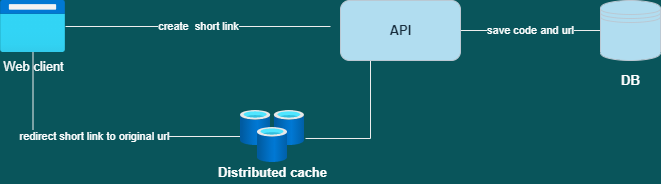

# Url shortener

This project consist on an API that shortens urls and redirects the shortened urls to the original url. We are using ASP.NET Core for the API, with EF Core as the ORM and an in memory database (probably an ORM is not necessary for a project like this, but it was faster for me at the time)

I am using a in memory data store, so the shortened urls are lost after some time. You can try it in this url https://jsurl.azurewebsites.net/swagger/index.html

The API is deployed on Azure App Service, on the free tier, so probably the first load will be slow as in the free tier the Appservice is shut down after some time if there are no new request.

## Overview

For this example I decided that a client server model would be the best option, so we can have more flexibility if we want to add the short url functionality to an existing client or create a web application only for this functionality. With the API I developed the server side. The client, distributed cache and persistent storage are missing. 

### Assumptions
- No authorization or authentication
- No analytics
- No editable urls
- No custom short urls
- No expiration
- The same url should have distincts short urls every time
- The traffic is bellow of the thousand of calls per second, so the performance of a relational database should be enough

## Next steps

### Testing
We have to create tests for the critical parts of the application, in this case I will test that the possible id collisions are handled without error, that the redirection from a short url to the original url works well and that the url is validated before creating the short url.

### Performance
If we discover performance issues with the current solution and the DB were the bottleneck we could explore options to improve the performance of the DB, like sharding. Another option could be to allowing eventual consistency on our application, and given that there aren't a lot of relations within our data model it will be easy to use some NoSQL DB, but we will have to make changes to the unique short codes generation to avoid collisions.

But probably our application will be more intensive on the reads than on the writes, so if we use some kind of distributed cache like Redis it will be harder to have performance bottlenecks on the DB or API. Also, we are using a Permanent Redirection 301 to redirect the short url to the original url, so we have the advantages of HTTP caching.
